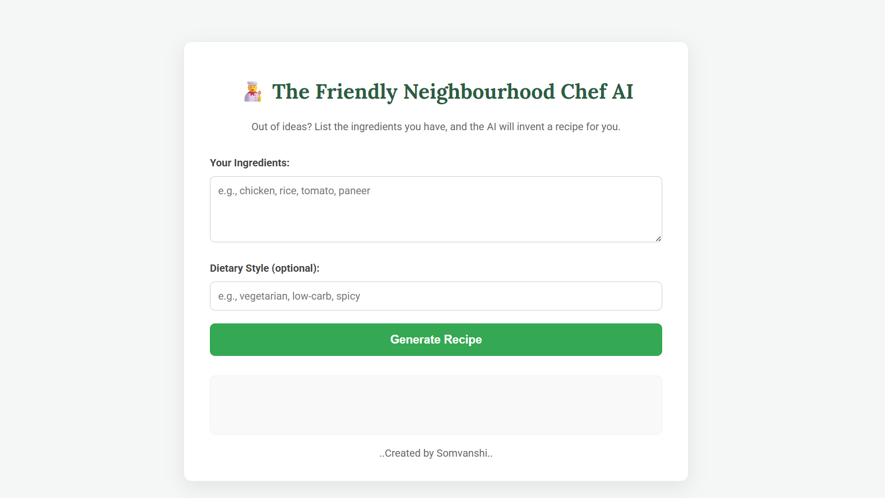
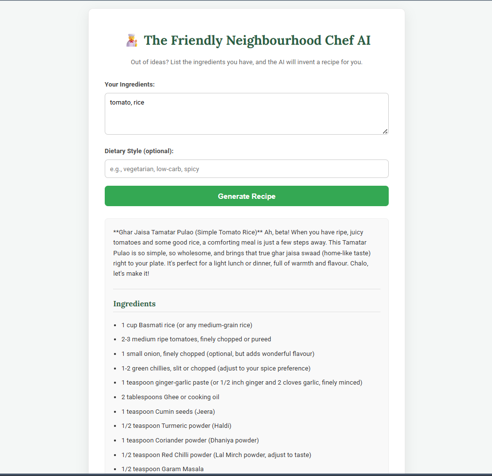
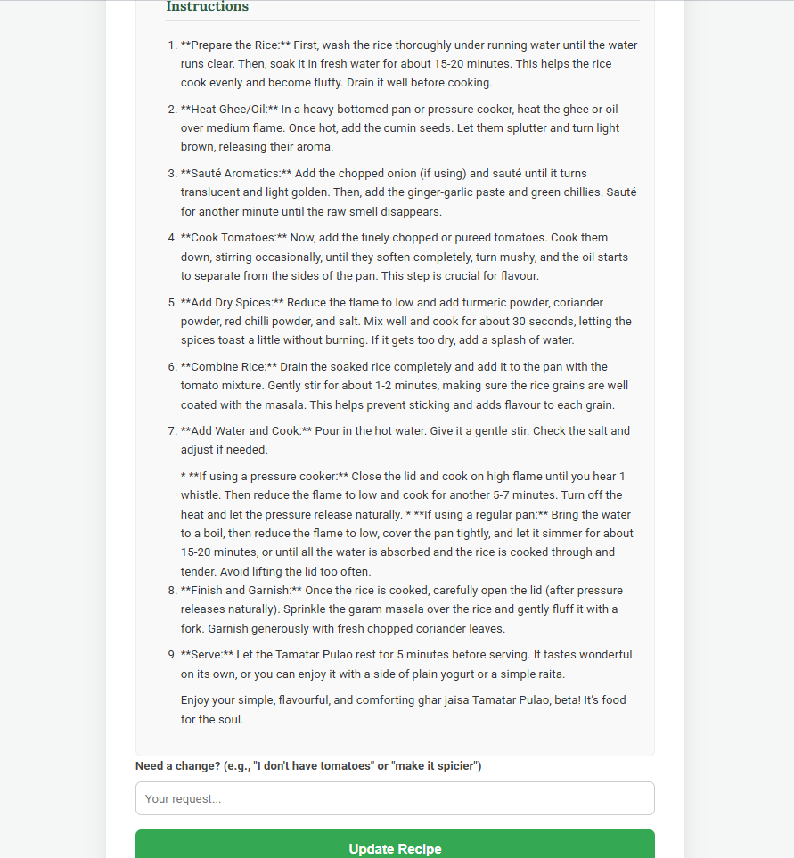

# 🧑‍🍳 Friendly Neighbourhood Chef AI

An AI-powered web application that generates authentic North Indian recipes using the ingredients you already have at home.

🌐 **Live Demo**: https://neighbourhood-chef.onrender.com

---

## 🚀 Features

* 🥗 Generate recipes from available ingredients
* 🌶️ Customize recipes based on dietary preferences
* 🔄 Modify recipes conversationally (e.g., "make it spicier", "no tomatoes")
* 🧠 Context-aware AI responses using Google Gemini
* 🎯 Simple, clean, and user-friendly interface

---

## 🛠️ Tech Stack

* **Frontend**: HTML, CSS, JavaScript
* **Backend**: Flask (Python)
* **AI Model**: Google Gemini API
* **Deployment**: Render

---

## ⚙️ How It Works

1. Enter the ingredients you have
2. (Optional) Add dietary preferences
3. AI generates a complete recipe
4. Modify the recipe with follow-up requests

---

## 📸 Screenshots

### 🏠 Home Page


### 🍲 Generated Recipe


### 🔄 Modify Recipe


## 🔐 Environment Variables

Create a `.env` file in the root directory and add:

GOOGLE_API_KEY=your_api_key_here

---

## 💻 Installation & Setup

```bash
git clone https://github.com/AayushSomvanshi/Friendly-Neighbourhood-Chef.git
cd Friendly-Neighbourhood-Chef

pip install -r requirements.txt

# Set your API key
export GOOGLE_API_KEY=your_api_key_here   # Mac/Linux
set GOOGLE_API_KEY=your_api_key_here      # Windows

python app.py
```

Then open: http://127.0.0.1:5000

---

## 📁 Project Structure

```
Friendly-Neighbourhood-Chef/
│
├── app.py
├── requirements.txt
├── .gitignore
│
├── templates/
│   └── index.html
│
└── static/
    └── style.css
```

---

## 🚧 Future Improvements

* 💬 Chat-based interface (like ChatGPT)
* 🎤 Voice input support
* 📸 Image-based ingredient detection
* 💾 Save & manage recipes
* 🌙 Dark mode

---

## 👨‍💻 Author

**Aayush Somvanshi**

GitHub: https://github.com/AayushSomvanshi

---


